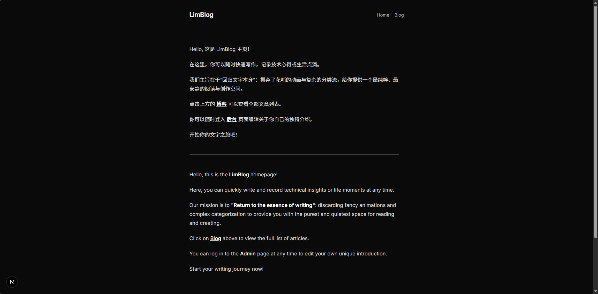
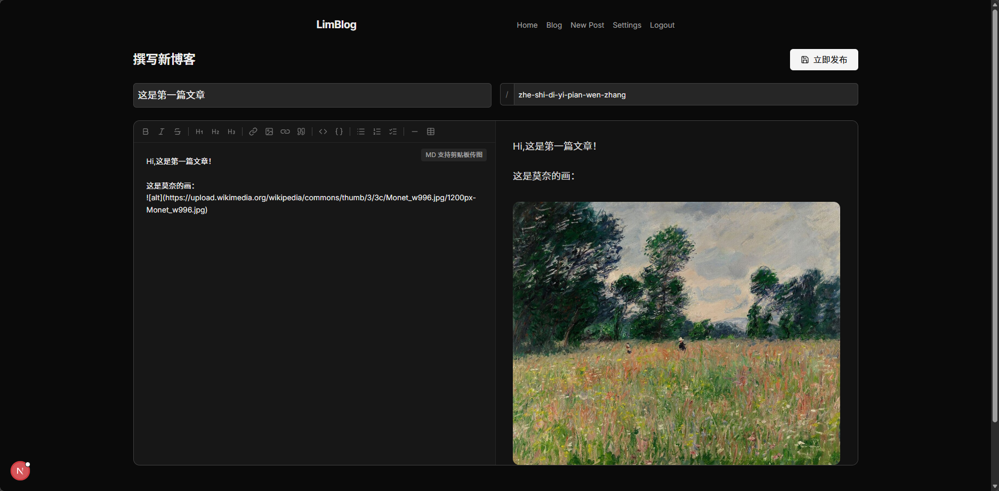

# LimBlog

**Less is More.**

LimBlog 是一个模仿 [Bear Blog](https://bearblog.dev/) 风格的极简博客系统。它专为热爱写作的人设计，剔除了所有不必要的干扰，提供一个纯粹、安静的创作空间。

---

## 📸 界面预览

| 🏠 首页 | 📝 撰写文章 |
| :---: | :---: |
|  |  |

| 📚 博客列表 | ⚙️ 站点配置 |
| :---: | :---: |
|  |  |

---

## ✨ 核心特性

- **极简至上**：无广告、无跟踪脚本，极其轻量，毫秒级加载。
- **现代化技术栈**：基于 Next.js 15 (App Router) + Prisma + Tailwind CSS。
- **强大的编辑器**：
  - 支持全功能 Markdown 语法。
  - **本地图片上传**：支持直接粘贴 (Ctrl+V) 或拖拽图片上传。
  - **智能压缩**：上传图片自动转换为 WebP 格式并压缩大小，兼顾画质与加载速度。
  - **外链视频优化**：完美支持 Bilibili、YouTube 嵌入，自动适配 16:9 比例并默认禁用自动播放。
- **灵活的 Slug 管理**：标题与 URL (Slug) 自动同步，支持手动锁定修改。
- **数据自主**：
  - 使用 SQLite 数据库，单文件存储，备份极其简单。
  - **导入/导出**：支持一键导出所有文章为带元数据的 Markdown 文件。
- **完全自托管**：支持 Docker 一键部署，数据持久化存储。

---

## 🚀 快速部署

### Docker Compose (推荐)

最简单、快捷且保持环境整洁的部署方案。

```bash
git clone https://github.com/ifndf/limblog.git
cd limblog
sudo docker compose up -d --build
```

访问 `http://localhost:3456` 即可开始使用。

**持久化说明：**
- 数据存放在宿主机的 `./data` 目录。
- 数据库路径：`/app/data/limblog.db`
- 上传图片路径：`/app/data/uploads/`

### 本地开发

需要 [Node.js](https://nodejs.org/) >= 20。

```bash
git clone https://github.com/ifndf/limblog.git
cd limblog
npm install
npx prisma db push
npm run dev           # 访问 http://localhost:3000
```

---

## 🔐 管理后台

前台页面不提供明显的登录入口，以保持视觉统一。

- **登录地址**：`/login`
- **默认账号**：`admin`
- **默认密码**：`123456`

> [!IMPORTANT]
> 部署成功后，请第一时间在 **设置 -> 账户设置** 中修改默认账号及密码以确保安全。

---

## 📜 许可

本项目基于 MIT 协议开源。

**Powered by [LimBlog](https://github.com/ifndf/limblog)**
